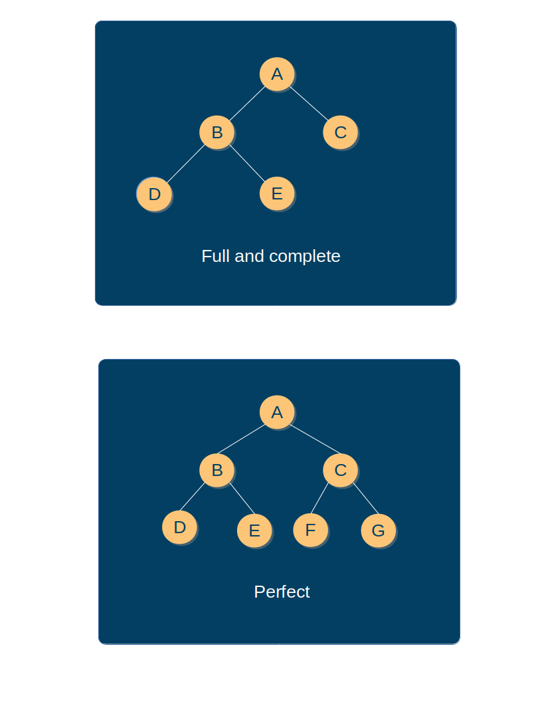
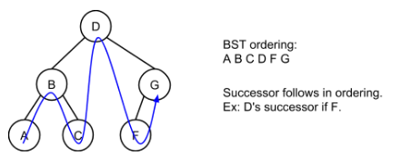

# Trees

## Binary Trees

In a list, each node is followed by a single node. In a binary tree, each node can have up to two child nodes. 

In computer science, trees are drawn upside down with the root being at the top and the branches and leaves extending downward. The edges connecting the nodes are optional.

## Terms

- Leaf: A node with no children
- Internal node: A node with at least one child. Even if a node has a single parent, the tree still qualifies as a binary tree.
- Parent: A node with a child. Ancestors are the parent node's parents up the tree.
- Root: The _top_ node.
- Edge: The link from a node to a child.
- Depth: The number of edges from the root to a node. The root has depth 0.
- Level: All nodes with the same depth form a tree level.
- Height: A tree's height is the largest depth of any node. A root only tree has height 0.

## Special types of binary trees

Different types of binary trees can affect the speed of operations on the tree.

- Full: If every node contains 0 or 2 children.
- Complete: If all levels, except maybe the last, are completely full and all nodes in the last level are as far left as possible.
- Perfect: If all internal nodes have 2 children and all leaf nodes are at the same level.




---

Binary space partitioning (BSP) is a technique of repeatedly separating a region of space into 2 parts and cataloging objects contained within the regions. This technique can be used in 2d games to allow rendering only those objects which are contained within the player's screen and ignore others. As the player's screen moves within the full map, the node containing a list of the objects coming into the player's screen are rendered. The alternative to calculating the intersection with the player's screen bounds which can be quite time consuming.

## Binary Search Trees

Binary search trees (BSTs) are especially useful in that they have an ordering property that any node's left subtree keys <= the node's key and the right subtree's keys >= the node's key. It enables fast searching operations.

## Algorithm for searching a BST
```python
if currentNode.key == desiredKey:
    return currentNode
elif desiredKey < currentNode.key:
    // Visit left child, repeat.
elif desiredKey > currentNode.key:
    // Visit right child, repeat.
```
If the left or right child to be visited for the search is null, the desired node does not exist.

```python
def bst_search(tree, key):
    cur = tree.root
    while cur is not None:
        if key == cur.key:
            return cur  # Found!
        elif key < cur.key:
            cur = cur.left
        else:
            cur = cur.right
    return None  # Not found :(
```

BST searching is fast because the levels in a tree increase very slowly and we only need to visit a few nodes to cover a lot of ground in terms of finding the desired key.


## Algorithm for inserting into a BST

- Insert as left child if new node's key is less than current node and the current node's left child is null.
- Insert as right child if key is greater and right child is null.
- Search for insert location if left or right child is not null, the algorithm assigns the current node as that child and continues searching.


```python
def bst_insert(tree, node):
    if tree.root is None:
        tree.root = node
        node.left = None
        node.right = None
    else:
        cur = tree.root
        while cur is not None:
            if node.key < cur.key:
                if cur.left is None:
                    cur.left = node  # Set node
                    cur = None
                else
                    cur = cur.left
            else
                if cur.right is None:
                    cur.right = node  # Set node
                    cur = None
                else
                    cur = cur.right
        node.left = None
        node.right = None
```

For a tree with N nodes, the number of loop iterations will be O(logN).

Best case: O(logN)

Worst case: O(N) when the tree is a succession of numbers 1, 2, 3 ...

## Algorithm for removing from a BST

The remove operation should remove the first matching node, restructuring the tree to preserve the BST ordering property.
First we use the search algorithm to find the matching node. Then perform one of the following sub-algorithms:
- Remove a leaf node: If N has a parent then the parent's left or right child (whichever points to N) is set to null. If N is the root and has no parent, the root is set to null for an empty BST.
- Remove an internal node: If N has a parent, then the pointer to N is assigned with N's single child. Same for root.
- Remove an internal node with two children: Locate N's successor (leftmost child or N's right subtree) and copy successor to N. Then recursively remove the successor from the right subtree.

```python
def bst_remove(tree, key):
    p = None  # parent
    c = tree.root  # current
    while c is not None:
        # search
        if c.key == key:  # node found

            if not c.left and not c.right:  # remove leaf
                if p is None:
                    # is root
                    tree.root = None
                elif p.left == c:
                    p.left = None
                else:
                    p.right = None
            elif c.left and not c.right:  # remove node with only left child
                if p is None:
                    tree.root = c.left
                elif p.left == c:
                    p.left = c.left
                else:
                    p.right = c.left

            elif not c.left and c.right:  # remove node with only right child
                if p is None:
                    tree.root = c.right
                elif p.left == c:
                    p.left = c.right
                else:
                    p.right = c.right
            else:  # remove node with two children
                # find successor (leftmost child of right subtree)
                s = c.right
                while s.left:
                    s = s.left
                data = s.key
                bst_remove(tree, data)  # remove successor
                c.key = data
            return  # node found and removed
            
        elif c.key < key:  # search right
            p = c
            c = c.right
        else:  # search left
            p = c
            c = c.left
    return  # not found :(
```

Best case: O(logN)

Worst case: O(N)

The removal is simply pointer updates.

## Algorithm for inorder traversl of a BST

It's so elegant and simple. Starting from the root node, the algorithm recursively prints the left subtree, the current node, and the right subtree.

```python
def bst_print_inorder(node):
    if node is None:
        return
    bst_print_inorder(node.left)
    print(node)
    bst_print_in_order(node.right)
```
To visit in descending order, swap the node.left and node.right pointers in the function.
If a node has a right subtree, the node's successor is that right subtree's leftmost child.



D -> F is such an example. If the node doesn't have a right subtree, the node's successor is the first ancestor having this node in a left subtree. Such as A -> B and C -> D.


## Efficiency

Searching a BST in the worst case requires H + 1 comparisons, meaning O(H) comparisons where H is the tree height. An _N-node_ binary tree's height may be as small as _O(logN)_, yielding extremely fast searches. A 10,000 node list may require 10,000 comparisons, but a 10,000 node BST may require only 14 comparisons.

A binary tree's height can be minimized by keeping all levels full, except maybe the last level. It's height is H = floor(log2N).

Inserts into the tree can create a lopsided tree if the insertion order is sorted. It's interesting to see that if we shuffle the input stream randomly, and then insert the items, we naturally get a minimized tree height!
